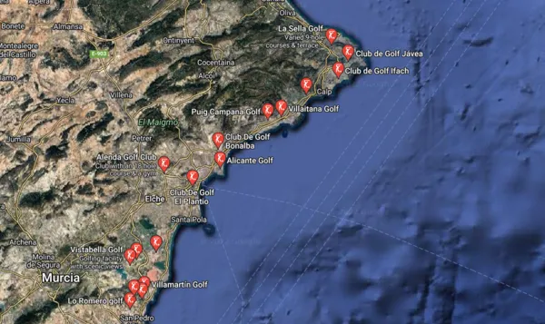

import BeraterKarte from "/src/components/Newsletter/BeraterKarte.astro";

## Mediterranes Lebensgefühl

fintag präsentiert einen neuen Partner für Ihre Immobilie in Spanien an der beliebten Costa Blanca: **PEYSU**.

## Immobilien an der Costa Blanca in Spanien mit Full-Service

Seit über drei Jahrzehnten ist die Firma Peysu mit ihrer Inhaberin Susanne Seiler und ihrem Team an der
südlichen Costa Blanca, Spanien als erfolgreiches Makler- und Serviceunternehmen vor Ort und findet für
seine Kunden immer das Richtige: Ob Wohnung oder Haus, Alt- oder Neubau zur Eigennutzung oder auch als
Objekt zur Ferienvermietung.

Eine professionelle Abwicklung, in spanischer, englischer und deutscher Sprache, mit anschließender
Betreuung durch bestehende Netzwerke ist für Peysu selbstverständlich und macht den Erwerb von Eigentum
an der Costa Blanca einfach.

fintag hat sein Produkt- und Anlagespektrum durch die Kooperation mit Peysu erweitert und hilft Ihnen,
mediterrane Lebensqualität durch den Kauf eines zweiten Wohnsitzes oder Ferienhaus/-wohnung im sonnigen
südlichen Spanien, zu erwerben.

Sprechen Sie uns an und verschaffen sich erste Eindrücke unter [www.peysu.com](https://www.peysu.com).

Ihr Ansprechpartner:

    <BeraterKarte berater="Frank Rathnau" />

----

## Information zur südlichen Costa Blanca

Die Costa Blanca ist der ideale Ort, um seinen Urlaub zu verbringen oder sich auch ganzjährig dem
mediterranen Lebensstil hinzugeben und dauerhaft in der Sonne zu leben. Es handelt sich um eine
mediterrane Landschaft mit unendlichen weißen Stränden, maritimen Dörfern und vielfarbigen Impressionen.
Entdecken Sie diese beeindruckende Landschaft im Süden von Spanien.

Von Alicante (Zielflughafen) über Torrevieja bis hin zum Mar Menor und Cartagena umspült das Mittelmeer
einen lichtdurchfluteten Landstrich mit einem ganz besonderen Klima.

Ihre vollkommene, touristische Infrastruktur, ihre zauberhafte Landschaft, eine vielseitige Gastronomie,
fröhliche Volksfeste, viele Sportmöglichkeiten, Kultur und ein breites Freizeitangebot machen die Costa
Blanca zu einem der kosmopolitischsten Orte in Europa, wo einheimische Kultur und die Besucher in perfekter
Harmonie miteinander verschmelzen.

Genießen Sie die sagenhaft schönen Strände und Buchten, besuchen Sie die alte Stadt Elche und erkunden
Sie den zum Weltkulturerbe erklärten größten Palmenhain Europas.

Einheimische Tavernen, Diskotheken, Pubs, Strandbars, Spielkasinos und vieles mehr bieten für jedes
Alter eine breites Freizeit-Spektrum.

Besonders der Golfer kommt hier auf seine Kosten. Eine Vielzahl von wunderbar angelegten Golfplätzen
lässt jedes Golfer-Herz höherschlagen.

Die Weltgesundheitsbehörde WHO, viele Ärzte sowie viele ausgewanderte Mitteleuropäer, attestieren der
Costa Blanca Süd ein hochkarätiges Heilklima. Ob Asthmatiker, Allergiker, Menschen mit
Herz-Kreislauf- Erkrankungen, Rheumatikern, alle diese Menschen leben hier gesünder und beschwerdefreier
als in den meisten Ländern dieser Erde. Entscheidend für die gesundheitsfördernde Heilwirkung sind die
zahlreichen Salzseen, deren außergewöhnliche heilende Wirkung nachgewiesen ist.

Damit ist sicher, dass die südliche Costa Blanca eine der hervorragenden Klimazonen dieser Erde ist.
Allein die gemäßigten Temperaturen dokumentieren die Sonderstellung der Costa Blanca in Europa.

Durch das bergige Hinterland vor den kühlen Winden der Meseta geschützt, bleibt die Durchschnittstemperatur
über das ganze Jahr angenehm hoch. Die Sommer sind warm, jedoch mit ca. 30 Grad nicht zu heiß, die Winter
sind mild und bieten mit ca. 16 - 22 Grad im durchschnitt die optimale Voraussetzung zum "Überwintern" für
alle Mitteleuropäer.

Alle Experten sind sich einig:

Bewohner der südlichen Costa Blanca genießen eine hohe Lebensqualität, leben gesünder und beschwerdefreier!
