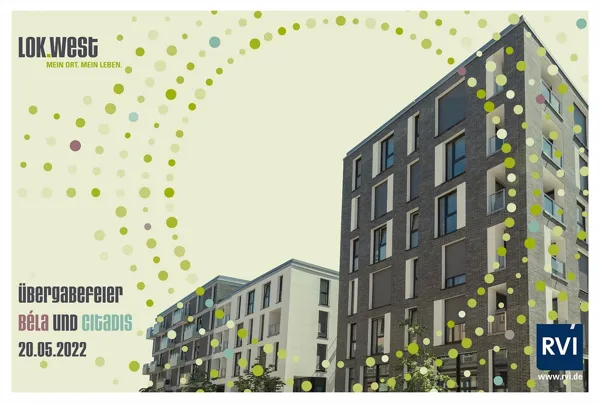
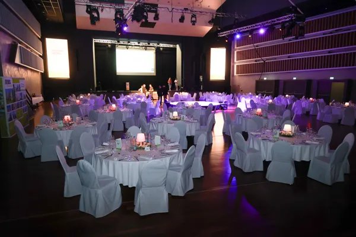
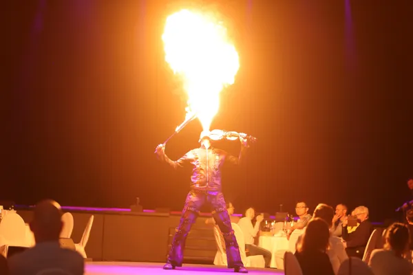
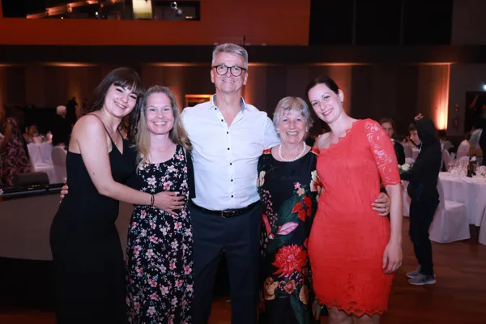

## Innovationspreis Reallabore 2022 des BMWK

Das Klimaquartier Neue Weststadt wurde am Abend im Rahmen einer Festveranstaltung mit dem
„Innovationspreis Reallabore 2022“ des Bundesministeriums für Wirtschaft und Klimaschutz (BMWK) ausgezeichnet.
Es erhielt den Publikumspreis in der „Sonderkategorie Nachhaltigkeit“, der erstmals vergeben wurde.
Im Rahmen eines Live-Votings erzielte das Klimaquartier 44% der Stimmen und setzte sich damit gegen zwei
weitere Finalisten durch.

Mehr Infos finden sie in der Pressemitteilung des RVI;
[Ausgezeichnetes Reallabor: BMWK Würdigt Klimaquartier neue Weststadt.](https://www.rvi.de/infothek/news/news-detail/news/ausgezeichnetes-reallabor-bundeswirtschaftsministerium-wuerdigt-klimaquartier-neue-weststadt/?tx_news_pi1%5Bcontroller%5D=News&tx_news_pi1%5Baction%5D=detail&cHash=1d956cab47a93c8a42651c265e2d739a)

----

## Die Übergabefeier LOK.WEST

RVI – nicht nur Profi im Bauen…

RVI ist seit 50 Jahren erfolgreich mit seinen Immobilienprojekten am Markt.
Vor allem auch dafür bekannt, dass die Projekte, egal welche Widrigkeiten in der Branche vorkommen,
der Kunde am Ende immer SAVE ist, da der Kaufpreis nebst Nebenkosten erst nach Mängelfreier Abnahme
fällig ist und die Mieten über mindestens 10 Jahre garantiert werden.

Bekannt ist aber auch, dass die RVI die Fertigstellung der Projekte, egal ob Rhein-Main-Gebiet, Region Stuttgart
oder Rhein-Neckar, richtig feiern kann.

So wurde auch das Projekt LOK.WEST in Esslingen mit der Fertigstellung der 3 Baukörper BELA, CITADIS und DESIRO
standesgemäß gefeiert.

Aufgrund der Anzahl der Wohnungen und damit verbundenen Anzahl der Kunden, wurde die traditionelle
Übergabefeier natürlich zur Herausforderung, da diese an 2 Tagen durchgeführt wurde.
Vorab: Dies wurde professionell gemeistert!

Das Neckar-Forum in Esslingen bot dafür den Rahmen und war für 2 Tage der Austragungsort einer wunderbaren Feier.
Die zahlreichen Gäste, Investoren, Berater, RVI Team, Handwerker, Vertreter von Stadt und Land, fanden sich
zunächst im festlich geschmückten Foyer ein. Bei Sekt, Cocktails, Kaltgetränken und Canapés begrüßte man
sich herzlich und freute sich über das Wiedersehen, weil das letzte Treffen mit dem ein oder anderen der
Kunden seit  den notariellen Beurkundungen ab 2016 schon einige Zeit her war.

Um 18 Uhr ertönte dann der Einlass in den festlich geschmückten Saal und die Gäste nahmen an den Ihnen zugeordneten
Tischen ihren Platz ein.

Ansprachen der RVI, Geschäftsleitung E. Szabo und C. Buschmann und weiteren Rednern begrüßten die Gäste und
informierten über den Weg der Planung bis zur Fertigstellung des Projektes Lok West.

Dazwischen wurde das köstliche Menü zelebriert und ein Unterhaltungsprogramm mit Zauberei, Artisten und
Showband sorgten für absolute Kurzweiligkeit bei den begeisterten Gästen.

Nach dem offiziellen Teil gegen 23 Uhr startet die Party in lockerer Atmosphäre bis in die frühen Morgenstunden.

Wir freuen uns bereits jetzt schon auf das nächste Event, welches in Mannheim stattfinden wird, da dort Ende des
Jahres sich bereits die ersten Wohnungen in der Fertigstellung des RVI-Projektes BALANCE auf dem
Franklin-Gelände befinden.

