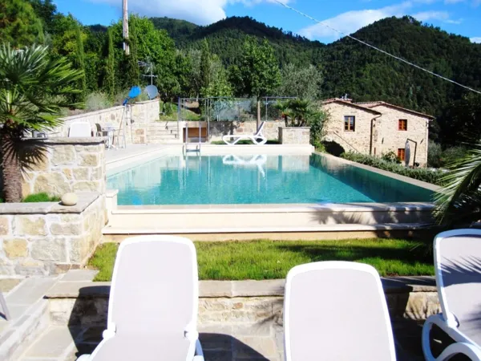

import {Image} from "astro:assets";
import MediaCard from "/src/components/MediaCard.astro";

## Die fintag AG freut sich ihren neuen Partner für italienische Immobilien vorzustellen

Unser Angebot wächst weiter, neben all den bekannten Produkten reiht sich nun eine weitere Sparte ein, die für
viele interessant sein wird. Mit unserem neuen Partner **ItalViva** und Frau Gitta Eckl-Reinisch erschließt Sie mit
uns den italienischen Markt.

Aber bevor wir hier etwas vorweg nehmen, lassen Sie sich von unserer neuen Partnerin selbst überzeugen:

----

## Ihr Traumleben in Italien

Schon seit Jahren liebäugeln Sie mit dem Gedanken Ihr Lieblingsurlaubsland zu Ihrem zweiten Zuhause zu machen. War es
bislang eher ein Gefühl, so finden sich in letzter Zeit immer mehr Gründe, diese Idee wahr werden zu lassen:

Die Bank hat Sie vor Kurzem darauf hingewiesen, dass bald Negativzinsen für das Konto zu zahlen sind. Die Planung Ihres
Urlaubs - Monate im Voraus - , das Herumrecherchieren, Anrufen, Nachfragen ist Ihnen lästig. Allein der Gedanken,
am Ankunftstag erst um 15.00 Uhr ins Zimmer zu können, stört Sie. Und die Aussicht mit all den anderen Hotelgästen
zu einer festgelegten Zeit zum Abendessen zu gehen, entspricht so gar nicht (mehr) Ihren Vorstellungen von einem
entspannten Sein. Dass Sie dann vielleicht auch noch am frühen Morgen ein Handtuch auf die Liege legen müssen, um
sich im Laufe des Tages am Pool ausstrecken zu können, ist das Tüpfelchen auf dem I.

**Sie möchten endlich spontan entscheiden, wann Sie Ihre Tasche ins Auto werfen und nach Italien fahren**. Stellen Sie
sich vor, Sie können über Ihre Zeit frei bestimmen, kommen und gehen, wann es Ihnen passt! Auf die Annehmlichkeiten
des Zuhauses nun auch in Italien nicht mehr verzichten müssen, z.B. auf die Zuverlässigkeit des Kaffee-Vollautomat!
Den Spritz dann trinken, wenn Sie es wollen und nicht auf die Baröffnungszeiten angewiesen sein! Sie möchten ihre
Familie willkommen heißen, ohne verzweifelt weitere Zimmer suchen und buchen zu müssen! Italien lieben Sie als
Ferienziel, doch endlich einzutauchen ins echte Leben und nicht länger als Tourist schief angesehen zu werden,
würde Ihrer Vorstellung von einem gelungenen Leben genau entsprechen!

**Finden Sie sich in einigen oder vielleicht all diesen Wünschen wieder?**

Dann sprechen Sie uns an! Wir, Gitta Eckl-Reinisch, Inhaberin von ItalViva Immobilien und ihr Team begeisterter
Italienspezialisten, freuen uns, wenn wir Ihnen den Weg zur Traumimmobilie in Italien bereiten dürfen. Vom ersten
Gedanken an die Immobilie bis zur Schlüsselübergabe, über den gesamten Kaufprozess bis zur Unterschrift beim Notar.
Beeidigte Übersetzungen, Dolmetscherdienste, Besichtigungen und das Verhandeln vor Ort übernehmen wir
selbstverständlich ebenfalls gerne für Sie.

Verwirklichen Sie Ihr Italien-Abenteuer – mit Sicherheitsnetz!

Mehr Infos finden Sie auf [https://www.italviva-immobilien.de/](https://www.italviva-immobilien.de/).

Ihre Ansprechpartnerin:

    <MediaCard>
        <Image src="https://italviva.de/wp-content/uploads/2023/10/Gitte-Eckl-Reinisch.jpg.webp"
               alt="" slot="image" class="object-cover object-center w-full h-full" inferSize={true} />

        <h2 className="m-0">Gitta Eckl-Reinisch</h2>
        ItalViva Accademia 
        ItalViva Immobilien 
         
        Telefon: +49&nbsp;(0)8102-748639 
        Mobil: +49&nbsp;(0)162-6870106 
        E-Mail: info@italviva.de
    </MediaCard>

