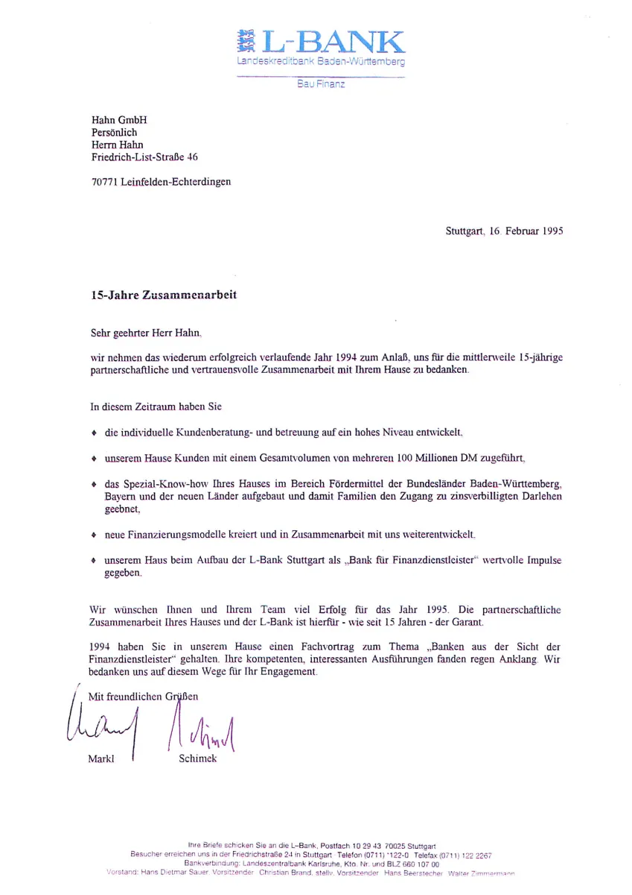

## Und es gibt sie doch noch!

Darlehen mit **NULL** Prozent Zinsen auf Hausfinanzierungen bei jungen Familien!

Sie oder Ihre Kinder, Freunde oder Bekannte planen, ein Haus/eine Eigentumswohnung – auch Zweifamilienhaus! –
in Baden-Württemberg zu bauen, zu kaufen oder zu renovieren ??

----

Die Landesbank Baden Württemberg bietet folgende Highlights:

- Z 15 Darlehen zu NULL Prozent Zins über 15 Jahre
- Modernisierungsdarlehen anstatt KfW Darlehen (261) 120.000€ zu NULL Prozent, Tilgungszuschuss ebenfalls möglich
- Darlehenshöhe abhängig von der Größe der Familie: z.B. drei Personenhaushalt 200.000, vier Personenhaushalt: 265.500 usw.
- Ärztlich bestätigte Schwangerschaft ab dem 3. Monat gilt bereits als vollständiges Familienmitglied
- 0% Zins zzgl. 2.25% Tilgung ergibt auf dieses Darlehen eine geringere Belastung als die aktuellen Bankkonditionen ohne Tilgung
- Zwei tilgungsfreie Anlaufjahre erleichtern den Start ins neue Eigenheim
- Ergänzungsdarlehen bis auf notwendige Finanzierungshöhe aktuell mit banküblichen Erstrangkonditionen bei nur 2% notwendiger Tilgung
- Zusatzfinanzierung bei Barrierefreiheit
- Zinsbindungen bis zu 25 Jahren auf heutigem Niveau sichern die nachhaltige Finanzierbarkeit
- Familienzuwachsdarlehen
- Jedwede Kombination mir den Fördermöglichkeiten energetischer Förderung (z.B. KfW, Photovoltaik)
- Eigennutzung ist immer zwingende Voraussetzung, Teilvermietung – auch gewerbliche Nutzung auch möglich

Ja – es gibt familiäre Voraussetzungen, die im Einzelfall geprüft werden müssen

3 Personen Haushalt:
1. Maximale Wohnungsgröße 160 qm (für 3 Personen !!!)
2. Maximales Familieneinkommen 69.500 € - Mutterschaftsgelder werden NICHT angerechnet
3. Maximales Eigenkapital 50%
4. WICHTIG aber: der verpflichtende Vertrag (z.B. Notarvertrag, Bauträgervertrag) darf nicht abgeschlossen sein, bevor die Prüfung durch die Bank beginnt
5. Usw.

Aber jeder einzelne Fall muss von einem fachkundigen Finanzierungsberater geprüft werden –

Die fa **fintag** und ihre Schwestergesellschaft die Hahn GmbH haben 45 Jahre Erfahrung in der Prüfung von LAKRA
Darlehen und Tausende zufriedener Kunden

wir haben **KEINE** Online Prüfplattform, denn

- die Stellschrauben für die Bewilligungsfähigkeit sind vielseitig
- Fallstricke müssen vermieden werden
- wir bevorzugen das persönliche Beratungsgespräch
- die erste Prüfung ist selbstredend kostenfrei

Diese Chance für Ihr Eigenheim sollten Sie sich nicht entgehen lassen –

**Vereinbaren Sie einen Telefontermin oder empfehlen Sie uns weiter!**

Apropos Empfehlung...

Das folgende Empfehlungsschreiben wurde an uns zur 15-jährigen Zusammenarbeit mit der L-Bank geschrieben. Damals wie
auch heute ist die Unternehmensgruppe fintag und Hahn durch Ihre außerordentliche Dienstleistung, Kundenbetreuung
und fachliche Kompetenz aufgefallen, sowohl bei unseren Partnern als auch unseren Kunden.

