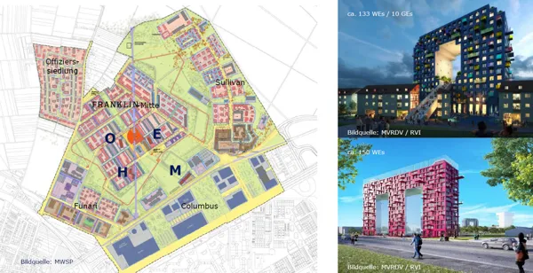
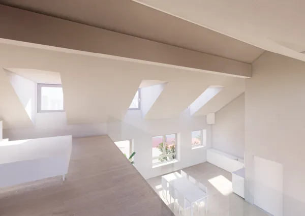

Liebe Kunden, Freunde und Interessenten,

Die **fintag** setzt seit Jahren verstärkt auf die Vermarktung des Produktes „Immobilie“ als Kapitalanlage,
Baustein zur Altersvorsorge und Inflationsschutz.

Ob im prosperierenden Speckgürtel unserer Hauptstadt Berlin, Leipzig, Spanien (Costa Blanca) oder Italien und derzeit
Rhein-Neckar-Metropolregion in Mannheim - Neubau – und auch Bestandsimmobilien – für jeden Geldbeutel und Wunsch –
können wir Lösungen unterbreiten.

----

Unser besonderes Augenmerk möchten wir heute erneut auf das ehemaligen Kasernengelände der US-Amerikaner in Mannheim,
Franklin-Village, lenken. Hier entsteht in ungewöhnlich, hoher Geschwindigkeit und Dynamik ein moderner,
zukunftsweisender Stadtteil für 8.000 neue Bewohner.

Vom Einfamilienhaus – Mehrfamilienhäuser, Schulen, Kindergärten, Altersheime, Sport und Freizeitstätten, aber auch
Einzelhandel, Discounter, Einkaufscentren – werden in sehr großzügiger und offener Bauweise auf dem 140 Hektar großen
Gelände erstellt. Der Startarchitekt Winy Maas aus den Niederlanden hat sowohl für die Grundlagengestaltung des
Quartiers als auch für die Architektur des Highlights Orbit federführend beigetragen.

4.000 Menschen konnten ihre neuen, bzw. neu sanierten Häuser bereits beziehen, die Gleise der Stadtbahnen zum
Anschluss an die Innenstädte Heidelberg und Mannheim sind bereits gebaut und werden erweitert.

Als Toppartner der Mannheimer Stadtentwicklung konnte die RVI GmbH - Tochter saarländischer Volks- und
Raiffeisenbanken – gewonnen werden, die mit ca. 520 Wohneinheiten, 40 Gewerbeeinheiten an insgesamt fünf
zentralen Standorten die Baufelder belebt.

Die Stadt Mannheim gestaltet und realisiert mit RVI und anderen Initiatoren einen hoch innovativen neuen Stadtteil.

Links:
- [Offizielle Website zum Quartier Franklin](https://franklin-mannheim.de/)
- [Winy Maas erklärt seine  Gedanken zum Objekt Orbit](https://youtu.be/akhwJSFAKho)
- [Drohnenflug über das Gelände](https://youtu.be/eW7GW6vKBmE)

----

## H.O.M.E

Das erste Projekt der RVI mit dem Namen „Balance“ wurde 2020 binnen weniger Monaten vermarktet. Hier werden, nach dem
aktuellen Baufortschritt, am Jahresende die ersten Wohnungen fertig gestellt.

Daran vorbei führt nun die neu verlegte Straßenbahn auf dem Weg zum „Orbit“ und ermöglicht im weiteren Verlauf kurz
Wege zu den öffentlichen Verkehrsmitteln, welche wiederum den Besuch der Städte in der Metropolregion Rhein-Neckar
vereinfachen.

Ein, in der Historie der RVI und bundesweit einmaliges Projekt, das „Orbit“, befindet sich derzeit im Bau und wirft
bereits jetzt seine Schatten voraus. Das Gebäude wird aktuell erstellt und das Ausmaß der Tiefgaragen mit all seinen
zusätzlichen Räumlichkeiten im Kellergeschoß sind bereits sichtbar. Ein Besuch lohnt des Areals lohnt sich – gerne
können Sie mit uns einen Termin vereinbaren.

Das sogenannte „Schwestergebäude“ E, lässt die Kunden vor Ort bereits erahnen, wie imposant der Schriftzug 4
Highlights werden – die Häuser H – O – M – E- Die Kunden und Interessenten, welche sich das komplette Franklin
Areal bis hin zu den Baustellen anschauen sind absolut begeistert und freuen sich auf die Highlights im weiteren
Verlauf.

Nicht nur die Außengestaltung ist modern, es ergeben sich auch sensationelle Wohnsituationen.

----

## Die neue AfA-Regelung der Ampel

Nun noch ein Hinweis, der für Kapitalanleger wichtig ist:

> „Im Koalitionsvertrag hatten sich die Ampel-Parteien darauf verständigt, die lineare Abschreibung beim Neubau
von Mietwohnungen von aktuell zwei auf drei Prozent jährlich anzuheben. Die Anpassung des AfA-Satzes wird nun in
die Tat umgesetzt. Der Referentenentwurf für das Jahressteuergesetz 2022 sieht vor, dass neue Mietwohngebäude,
die ab 2024 fertiggestellt werden, mit drei Prozent jährlich abgeschrieben werden können. Die Abschreibungsdauer
würde damit von 50 auf 33 Jahre reduziert“
>
> *Quelle: Haufe Online Redaktion vom 2. August 2022*

Was bedeutet diese Neuregelung für den Kapitalanleger:

Die angestiegenen Zinsen bei Baudarlehen, können durch die Steuerersparnis im Bereich Vermietung und Verpachtung
gemäß dem individuellen Steuersatz entsprechend, rechnerisch gemindert werden.

Aber auch für den Komplettzahler einer vermieteten Immobilie bleibt mehr im eigenen Geldbeutel (Einkünfte aus V + V).

Warten wir also die nächsten Wochen noch ab, da dies zunächst der Referentenentwurf ist und im Gesetzgebungsverfahren
noch mit drei Lesungen durchs Parlament geht.

Sprechen Sie uns an. Investieren in Immobilien lohnt sich immer!

**Ihre Monika Sanders und Frank Rathnau**
