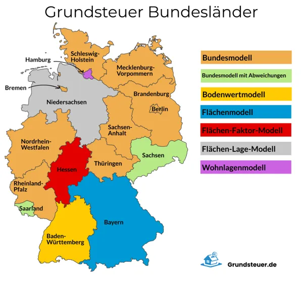
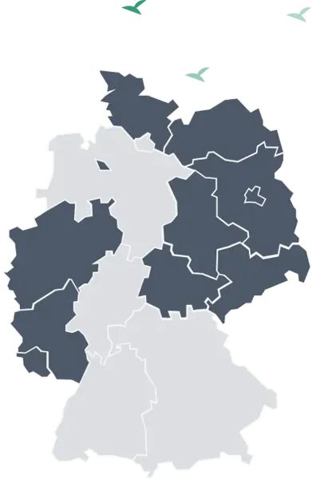

## Grundsteuer in Deutschland

### Ein Musterexemplar für die verbliebene Kleinstaatlichkeit und das erschreckende Unvermögen der Finanzämter, Kundendaten digital aufzunehmen

----

Es ist mir ein echtes Vergnügen, fast täglich mit meinem ersten Kaffee humorvolle, ironische Artikel und Leserbriefe
zum Thema Grundsteuerreform zu lesen („Hör mal Elster – auflegen gilt nicht“, Stuttgarter Zeitung 04.08.2022)

Nur leider hilft dieses Vergnügen kaum weiter, wenn sich 36 Millionen Bürger dann an die verpflichtende Abgabe der
Grundsteuererklärung begeben. Natürlich ist es absolut legal, den Steuerberater mit der Aufgabe – wie gewohnt zu
betrauen – sofern er noch Kapazitäten hat, aber auch er benötigt die erforderlichen Angaben, die weit über die
Angaben der Anlage V+V der EkSt. Erklärung hinausgehen.

Hier die ersten beiden wesentlichen Erkenntnisse:

## 7 Modelle der Grundsteuerermittlung:

Die Grundsteuererhebung ist Sache der Länder – und trotz des Europäischen Geistes und der vielbemühten Globalisierung
haben es die Bundesländer nicht geschafft, sich in der simpel erscheinenden Frage der Neuordnung der
Grundsteuerregelung zu einigen – so sind sage und schreibe 7 Modelle zur Ermittlung der neuen Grundsteuer entstanden
(was für eine Verschwendung von Ressourcen).

Nun – man stelle sich einen Bundesbürger vor, der in Weinheim lebt und – aus Erbschaft/Umzugs- oder
Kapitalanlagegründen in Esslingen, Frankfurt und Sachsen-Anhalt Wohnungen sein Eigen nennt – er hat vier
unterschiedliche Arten von Erklärungen abzugeben.

## Wege der Anmeldung der Daten:

1. Drei Bundesländer verlangen vom Bürger die Eingabe der Daten ausschließlich über Elster – WUNDERBAR – aber Elster
   ist sperrig – und selbst wenn der Bürger tapfer alle Daten ermittelt hat, so verweigert sich das Programm an
   merkwürdigen Punkten: die Null kann auf drei verschiedene Arten eingegeben werden – das Wort Null- die Zahl 0
   (nicht zu verwechseln mit dem Buchstaben O wie Otto) aber auch dadurch, dass man NULL eingibt – dann zu speichern
   versucht – und bei Fehlermeldung die „Null“ löscht – und dann macht das Programm weiter
2. Elf Bundesländer haben sich für die etwas leichter zu handhabende Webseite
   www.grundsteuererklärung-fuer-privateigentum.de entschieden – ein DigitalService, entwickelt im Auftrag des
   Finanzministeriums….
3. Und wenn eine 89-Jährige zwar die Steuererklärung abgeben möchte, aber altersbedingt leider nicht
   digital orientiert ist – so darf sie – als begründeter Härtefall einen Papierbogen beantragen, der
   entweder beim zuständigen Finanzamt abgeholt werden muss – oder je nach Gnade des Finanzbeamten sogar per
   Post zugesendet werden könnte. Nehmen wir unseren Kunden aus Weinheim – er muss bei 4 Finanzämtern – nämlich
   immer am Standort der Immobilie - diesen Härtefallbogen beantragen. Dieser Bogen wird dann begleitet von acht
4. Seiten „Bedienungsanleitung“ im feinsten Beamtendeutsch der Finanzämter
   Andere Bundesländer wiederum bieten beschreibbare PDF's an – Bayern und Hamburg sogar die Möglichkeit, ein
   Formular handschriftlich auszufüllen – und ans Finanzamt weiterzuleiten.
5. Man munkelt – zumindest in Baden-Württemberg – es solle auch bald eine beschreibbare PDF geben, die man dann
   an das ZUSTÄNDIGE Finanzamt senden darf, nun denn – vielleicht kommt diese „Erleichterung“ ja noch

> Quelle: https://www.grundsteuererklaerung-fuer-privateigentum.de

Sorry, die Verfasserin wollte wirklich nicht in die Reihe der ironischen Kommentare abgleiten - aber es fällt wirklich
schwer, nicht zur Revoluzzerin zu werden.

## Also wenden wir uns einigen wichtigen allgemeinen Fakten zu

Unter dem beigefügten Link finden sie ein Merkblatt mit allgemeinen Informationen und eine Tabelle, die Ihnen pro
Bundesland sagt, welche Angaben Sie benötigen, wo Sie diese Angaben finden oder ermitteln können – und Tipps in
welcher Art sie diese Angaben weiterleiten müssen (nicht Dezimalzahl, sondern Bruch mit Zähler und Nenner 😊)

[Link zu den Unterlagen]()

Wir weisen ausdrücklich darauf hin, dass wir mit dieser Newsletter KEINE rechtliche oder steuerliche Beratung
vornehmen, sondern - unter Ausschluss jeglicher Haftung - das Wissen zusammenstellen, das wir in den letzten
Monaten zusammengetragen haben. 95% unsere Kunden sind Immobilienbesitzer – die Anzahl der Anfragen um Hilfestellung
kommen verstärkt.

Wir hoffen Ihnen hiermit eine Hilfestellung zu geben, die Aussage, dass die Länder eine Fristverlängerung nach dem
31.10.2022 gewähren werden – hilft leider wenig – das heißt nur, dass wir den Ärger von heute auf morgen verschieben
dürfen !

Mit fast nicht ironischen Grüßen

**Ihre fintag**
