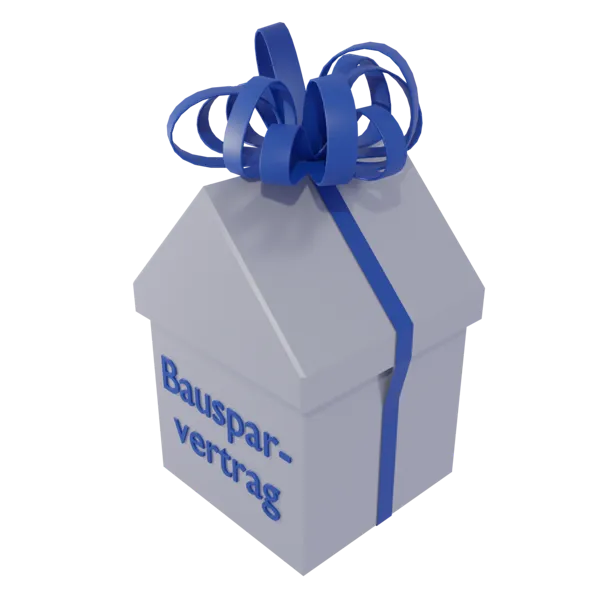

## Unglaublich aber wahr,
### Bausparkassen DÜRFEN ihre Tarife der historischen Niedrigzinsphase noch bis zum 31.12.2022 abschließen

Galten Bausparverträge lange Zeit als unrentabel, so werden diese - in Anbetracht der aktuell steigenden Zinsen
seitens der Europäischen Zentralbank (EZB) - für den kurzen Zeit-Slot bis zum 31.12.2022 hoch attraktiv. Zumal
davon auszugehen ist, dass weitere Zinserhöhungen wahrscheinlich sind.

Bis dahin können die Darlehenszinsen von 1 bis 2 % für die Darlehensphase auch jetzt noch für die Zukunft gesichert
werden. **Es gilt wieder einmal, die Chancen des Marktes aktiv zu nutzen**, zumal die Bausparkassen in den letzten
Jahren enorm flexible Tarifkonstruktionen auf den Markt gebracht haben.

## Für wen ist das interessant?

Wer sich in den nächsten Jahren Wohneigentum anschaffen möchte, Prolongationen bestehender Darlehen benötigt, oder
über Renovierungen und Sanierungen nachdenkt, sollte bis zum Jahresende diese Chance nutzen und sich damit die
historisch niedrigen Zinsen aus den Jahren 2016 bis Anfang 2022 sichern!

Der Vorteil des Bausparvertrages liegt darin, sich einen günstigen Zins für einen Baukredit bereits jetzt
festzuschreiben, selbst wenn der Kredit erst in fünf, zehn oder 15 Jahren in Anspruch genommen wird.

## Wie funktioniert ein Bausparvertrag?

Gerne berechnen wir für Sie  einen maßgeschneiderten Bausparvertrag, der auf Ihre individuellen Bedürfnisse
abgestimmt ist. Nutzen Sie einfach den beigefügten  Fragebogen –ausdrucken, ausfüllen und an uns per Mail,
Post o.ä. zurückschicken. Nach Auswahl des passenden Tarifs, Festlegung der gewünschten Darlehenssumme und
Vertragsabschluss, beginnt die sogenannte Ansparphase in Form von monatlichen Ratenzahlungen. Üblicherweise
müssen 25 – 50 % der Bausparsumme eingezahlt werden, bevor der Vertrag zuteilungsreif und ausgezahlt wird.
Diese Sparphase kann, dank attraktiver Tarifgestaltung, 2 – 16 Jahre lang sein; nach Zuteilungsreife kann
das Darlehen in der Darlehensphase bis zu 20 Jahre zurückgezahlt werden.

**Ihre Vorteile:**

- Sicherung des historischen Zinsniveaus für die Zukunft
- Planungssicherheit trotz steigender Baupreise und des aktuellen „Zinsschocks“

Die Bausparkassen werden ab Januar 2023 mit den Zinssteigerungen massiv nachziehen, die neuen Tarife liegend der Bafin bereits vor.

Gerne berechnen wir für Sie  einen maßgeschneiderten Bausparvertrag, der auf Ihre individuellen Bedürfnisse abgestimmt
ist. Nutzen Sie einfach den beigefügten Fragebogen; ausdrucken, ausfüllen und an uns per Mail, Post o.ä. zurückschicken.

**Neu: Sie können unseren Fragebogen auch Online über Microsoft Forms ausfüllen!**

[Link zum Fragenbogen (Microsoft Forms)](https://forms.office.com/Pages/ResponsePage.aspx?id=yLKqT2hpTUOUmzv-foG5D8yvYioplbBEpQgkz96gMDZUNFVPVEY2Vjk4QjhTSUlVQTlaNURWTThXRC4u)

[Link zum Fragebogen Bausparvertrag (PDF)](/unterlagen/Fragebogen_Bausparvertrag.pdf)

(PDF bitte im Adobe Reader öffnen!)

**Chance Bausparvertrag – jetzt noch niedrige Zinsen sichern!**

**2022 gilt mehr denn je 31.12.2022 ist Bauspartag!**

**Weitere Informationen folgen in Kürze.**

