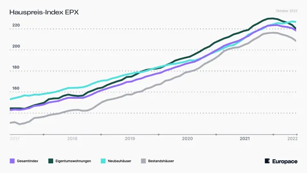

## Kommt eine Immobilien&shy;blase - oder nicht?

Dieses Thema wird mehr denn je in der öffentlichen Meinung diskutiert. Nun steigen auch
noch die Kreditzinsen und damit sehen einige Beobachter des Immobilienmarktes den
Zeitpunkt gekommen, an dem die Nachfrage rapide nachlassen muss und damit die Preise
fallen. Aber ist das wirklich logisch?

<!--more-->
----

Schauen wir uns 3 konkrete Punkte an, die nach unserer Auffassung das Gegenteil belegen,
nämlich das die Immobilienpreise und die Mietpreisentwicklung stabil bis weiter steigend
sein wird. Wie kommen wir zu dieser Einschätzung?

1. Wohnen ist ein Grundbedürfnis des Menschen. Daher ist der Bedarf vorhanden und wird
   ufgrund demographischer Entwicklungen steigen, durch
    - die Zuwanderung aus dem Ausland
        - Menschen, die aufgrund des Kriegs in der Ukraine flüchten
        - Flüchtende aus anderen Staaten
    - den Fachkräftemangel in Deutschland
2. Die Bundesregierung versucht zum wiederholten Male 400.000 Wohnungen im Jahr 2022 zu
   erstellen – tatsächlich werden max. 50 % der Zielvorgabe erreicht werden.
3. Zurückhaltung des Investments in den Neu- oder Ausbau von Immobilien, weil
    - die Preisentwicklung in der Bauindustrie nachweislich höher ausfällt als die allgemeine
      Inflation
    - die Zinsentwicklung der letzten Monate die Gesamtrechnung deutlich verteuert haben

Faktisch führen diese all diese Punkte zu einer typisch volkswirtschaftlichen Konsequenz:
Die Nachfrage nach Immobilien bleibt weiterhin höher als das zur Verfügung stehende Angebot,
d.h. die Preise können gar nicht fallen, sondern werden tendenziell eher steigen.

Durch die Annahme stabiler und steigender Mieten, wird die Immobile als Anlageinvestment
weiterhin attraktiv bleiben. Die Finanzpresse (beispielsweise FAZ vom 18.10.2022 - Volker
Loomann, der eigentlich eher immobilienkritisch eingestellt ist) bezeichnet in diesen
inflationären Zeiten die Immobile als eine gute Option einem Wertverlust des bestehenden
Vermögens vorzubeugen.

Unsere Argumentation fußt daher nicht auf eigenen Ideen und Vorstellungen, sondern auf
Argumenten aus renommierten Fachmedien.

Statistiken der Organisation für wirtschaftliche Zusammenarbeit und Entwicklung (OECD)
bestätigen, dass wir in Deutschland mit Bewertungsrücksetzern bei Immobilienpreisen rechnen
können. Diese Preisrückgänge werden sich aber bei rund 10% einpendeln, so dass die OECD von
einer „moderaten Blase“ in ihren Auswertungen spricht. (Stuttgarter Zeitung 24.11.2022)

Diese Entwicklungen erwarten wir bei älteren Bestandsimmobilien. Dagegen erweist sich die
künftige Wertentwicklung von Neubauten deutlich stabiler und dass trotz aktuell höherer
Investitionskosten. Diese Feststellung wird auch durch die nachfolgende Graphik bestätigt.

Zusammenfassen können wir festhalten:
1. Eine Immobilienblase zu prognostizieren, ist aus den genannten Gründen eher unwahrscheinlich
2. Zum Vermögenserhalt oder Vermögensaufbau bei hoher Inflation, ist die Assetklasse „Immobilie“
   unverzichtbar
3. WICHTIG! Bei einem Immobilieninvestment sind folgende Punkte essenziell:
    - Gute Lage der Immobilie
    - Professionelle Bauträger oder Immobilienentwickler
    - faire Immobilienpreise mit max. möglichen Garantien
    - Kreative und versierte Darlehensfachleute, die individualisierte Konzepte für Sie erarbeiten

Auf alle diese Punkte können wir Ihnen Antworten geben. Sprechen Sie mit uns – wir freuen uns auf
Ihren Anruf.

