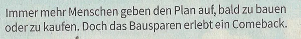

## Jetzt den Niedrigzins sichern

Wir haben Ihnen in den vergangenen Wochen schon aufgezeigt, warum sich ein Bausparvertrag gerade jetzt lohnt.

Die obige Überschrift stammt aus der Stuttgarter Zeitung, der Ausgabe vom 06.12.2022, mittlerweile hat sich
rumgesprochen das Bausparen sich wieder lohnt.

Dieser Newsletter ist nochmal eine kurze Erinnerung und ein Aufruf, diese Chance nicht vergehen zu lassen.
Sollten Sie planen zu bauen, zu kaufen, haben Kinder für die Sie Kapital ansparen wollen, haben Besitz der
eventuell irgendwann Saniert werden soll, oder haben generell freies Kapital das Sie gerne anlegen wollen,
oder wissen vierleicht noch gar nicht, ob ein Bausparvertrag für Sie in frage kommt, folgen Sie der folgenden
Checkliste und machen mit uns einen Termin.

## So kommen Sie zum Bauspar&shy;vertrag

Wichtig: **Der Annahme-Stop für neue Anträge ist der 21.12.2022**, vorher sollten wir mit ihnen Ihren gewünschten
Bausparvertrag durchgesprochen und Ihre Daten erfasst haben.

1. **Laden Sie das nachfolgend verlinkte Formular runter**, füllen es digital mit dem Adobe Reader aus und
   schicken Sie es uns zu.

Fragebogen Bausparvertrag: [Download](/unterlagen/Fragebogen_Bausparvertrag.pdf)

2. **Vereinbaren Sie einen Online-/Telefontermin**. Am einfachsten geht das über unsere Bookings-Seite unter diesen link:
   [Bookings](https://outlook.office365.com/owa/calendar/fintagAG@fintag.de/bookings/s/sgjS6pyHJEymsmOGgEPUQw2).
   Dort können Sie sich einen Termin aussuchen und wir kommen auf Sie zu.

3. **Wir bereiten alles vor** und sprechen mit Ihnen im Termin alles durch.
