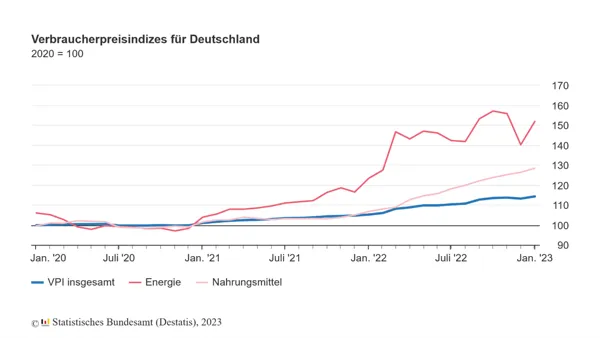

import ContactBox from "/src/components/Newsletter/ContactBox.astro";

## Wo ist mein Geld sicher Angelegt?

Jeden Tag eine neue Schlagzeile, die unsere finanzielle Absicherung angreift –
die Frage ist: Wie kann ich mein Geld schützen?

----

Zwar steigen die Zinsen – zumindest die Kreditzinsen –, aber auch die Inflation ist unverändert hoch.

Der harmonisierte Verbraucherpreisindex für Januar 2023 liegt bei +9,2 % zum Vorjahresmonat
(Quelle: Destatis 2023)

Schauen wir uns die hautsächlichen Treiber diese Inflation an, dann sind es primär die Energiepreise,
wobei auch Nahrungsmittel, für uns beim täglichen Einkauf nachvollziehbar, deutlich angezogen haben.

Das betrifft aber nur die eine Seite unseres Einkommens, die Ausgaben. Was sollten man in diesen
Zeiten mit Blick auf eine Kapitalanlage entscheiden? Was schützt mein Vermögen vor der Inflation
(= Geldvernichtung) und wo bekomme ich dennoch attraktive Erträge?

Diese Frage beschäftigt uns als Anleger bereits seitdem wir Geld renditeorientiert anlegen möchten.
Möglichst hohe Renditen, bei geringstmöglichem Risiko und natürlich täglich verfügbar. Wenn ich dann
auch noch Steuern mit der Investition sparen kann, ist das Glück vollkommen. Aber das diese Vorgaben
ein Wunsch sind und bleiben, weiß jeder informierte und realistische Anleger.

Was kann ich als Kapitalanlagen wählen?
Bankeinlagen (Sparkonten etc.), Anleihen (Bundes- oder Unternehmensanleihen etc.), Aktien, Immobilien,
Rohstoffe (im speziellen Gold). Aber was ist sinnvoll und richtig?

**Bankeinlagen** bringen weiterhin keine wirklichen Zinsen und unterliegen zu 100 % der Inflation,
weil es keinen realen Wert hinter dieser Anlage gibt.
**Anleihen** zahlen mittlerweile wieder Zinsen, aber teilweise nur mit längeren Anlagelaufzeiten.
Das birgt das Risiko, sollten die Leitzinsen durch die Zentralbanken weiter erhöht werden, dass
dies direkte Auswirkung auf den Verkaufskurs der laufenden Anleihen hat. Hier kann ich dann ggf.
Verluste nur vermeiden, in dem ich diese Anlage bis zu Endfälligkeit halten muss.
**Aktien** unterliegen Schwankungen – manchmal auch sehr starken Schwankungen. Waren die Tech-Unternehmen
der USA in den letzten Jahren die TOP-Investments, musste man in den letzten Monaten herbe Verluste
hinnehmen. Dennoch stehen hinter Aktien Unternehmen, die bei allen Schwankungen einen Wert darstellen,
der auch der Inflation auf lange Sicht trotzt. Wichtig ist hier nur die richtige Wahl der Aktien.
Gleiches kann man von **Immobilien**-Investments sagen. Im Anlegerbereich ist es die Kapitalanlageimmobilie,
die einerseits durch die Mieteinnahmen eine Rendite erzielen und anderseits durch eine gute Anlageanalyse
(Standort, Mietpreise, Immobilienbewirtschaftung etc.) eine Wertsteigerung beinhalten können.
**Gold** als Anlagewert in der Assetklasse Rohstoffe, ist eine reine Krisenwährung. Das bedeutet, das bei
dieser Anlage ganz bewusst auf eine Verzinsung verzichtet wird, weil man hofft, dass der Wert des Goldes
in Krisenzeiten stabil bleibt oder steigt. Es ist daher keine wirkliche Anlageklasse, da keine regelmäßigen
Erträge fließen, sondern eine Art Sicherungsvermögen.

Daher sind in Zeiten wie diesen, die Anlageklassen Aktien (hier kann auch sehr gut in Fondstrukturen
investiert werden, um eine hohe Risikostreuung zu erreichen) und Immobilien die Investitionen, um ihr
Vermögen gegen die Inflation zu schützen.

Sowohl bei einem Aktien- wie auch bei den Immobilieninvestitionen benötigt es hohe Kenntnisse in diesen
Anlagesegmenten. Daher ist es ratsam sich einen Berater zur Seite zu holen, der eine entsprechend große
Expertise in diesen Anlageklassen aufweisen kann.

Sprechen Sie uns daher gerne als Ihre Experten zu diesen Themen an. Wir können Ihnen mit unserer
jahrelangen Expertise bei Fragen zu diesen Anlageklassen mit Rat und Tat zur Seite stehen. Buchen Sie
gerne einen ersten Beratungstermin mit einem unserer Spezialisten.

<ContactBox subject='fintag Newsletter "Inflation und Geldentwertung"' />
