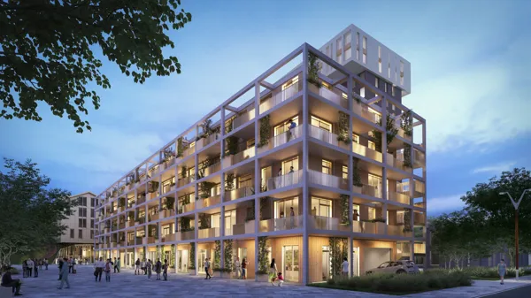
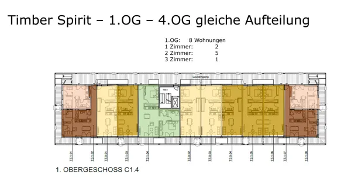

import ContactBox from "/src/components/Newsletter/ContactBox.astro";

*Zitat Carsten Buschmann, Geschäftsführer RVI: „Wir bauen, denn was anderes können wir nicht“*

Die RVI unser langjähriger Kooperationspartner startet in Kürze den Vertrieb des neuen Objektes Timber in
Mannheim – mal wieder beweist die RVI, dass Innovation, Nachhaltigkeit und Wohnqualität mit zahlbaren Preisen
vereinbar ist.

Mit folgenden Objektmerkmalen trifft die RVI den Zeitgeist:

- Holzhybridbauweise (Holz & Beton in Teilbereichen)
- schöne 1 - 3 Zimmer Wohnungen mit smarten Grundrissen
- jede Wohnung mit mindestens einem Balkon
- jede Wohnung mit eingebauter Küche
- Aufzug von der Tiefgarage bis zum 4. OG
- Laubengangerschließung zur Vermeidung langer, dunkler Flure
- Qualitative hohe Baustandards versprechen beste Aufenthaltsqualität für alle Generationen
- Einbau von Photovoltaikanlagen für Mieterstrom
- Anschluss an das Fernwärmenetz
- Fassadenbegrünung – Bewässerung über eine zentrale Bewässerungsanlage
- Großzügige Gemeinschaftsflächen
- geplanter Coworking Space für alle die, die das Homeoffice nicht über konstante Mieten zahlen wollen
- Keyless Schließsysteme und Video- Gegensprechanlage für hohen Komfort und Sicherheit

Für Kapitalanleger ist das Immobilieninvestment bei der RVI mit besonderen Sicherheitsmerkmalen versehen.
Die RVI Vermietung- und Verwaltung GmbH übernimmt kompetent und erfahren die vollständige Kommunikation
mit dem Endmieter, bis hin zur Nebenkostenabrechnung.

Hier die Highlights:

- Bauträger mit Bankenhintergrund
- Die Objekte werden durch Hausmeister betreut. Diese gewährleisten so einen hervorragenden Pflegezustand – auch in den Außenanlagen
- Kaufpreiszahlung incl. Grunderwerbssteuer, Notar -und Gerichtskosten erst bei erfolgter Abnahme und Übergabe der Einheit (d.h. kein Baukostenrisiko, kein Fertigstellungsrisiko)
- Mietgarantie für mindestens 10 Jahre - gerade bei steigenden Zinsen ist die 100 % Sicherheit der Mieteinnahme ein wesentlicher Vorteil für den Anleger

Kontaktieren Sie uns.

Immobilien sind und bleiben ein wesentlicher Bestandteil des Vermögensaufbaus.

<ContactBox subject='fintag Newsletter "Und es gibt ihn doch - den Mut zum Bauen"' />
