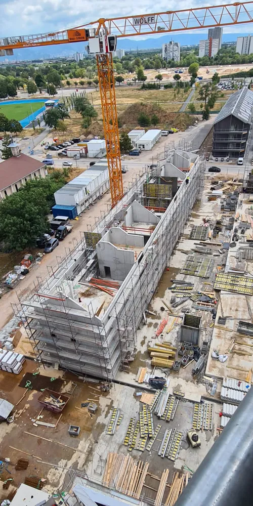
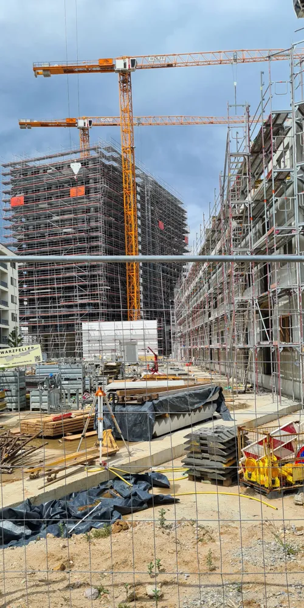
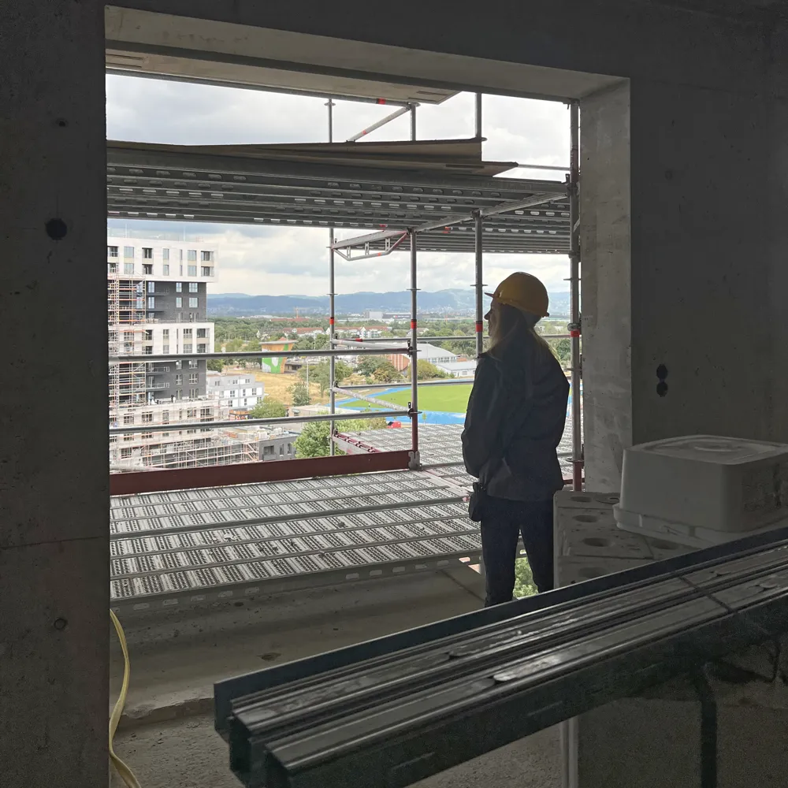
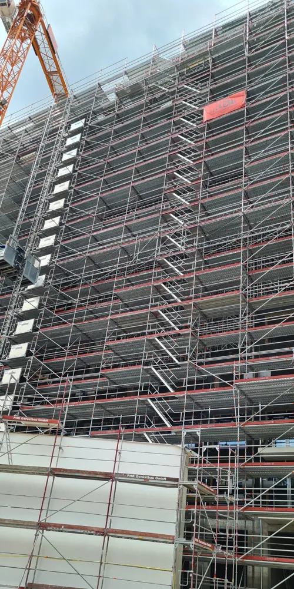
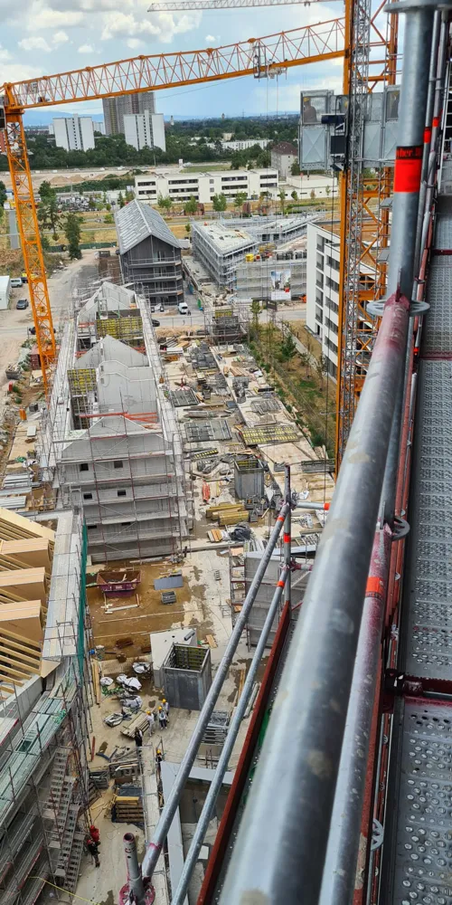
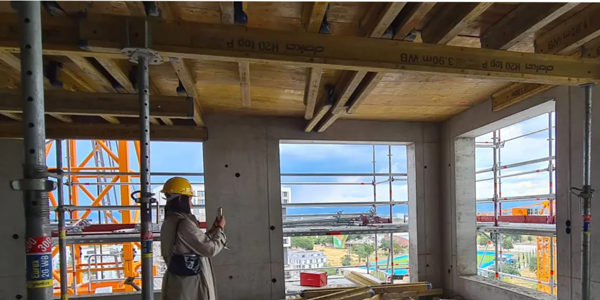
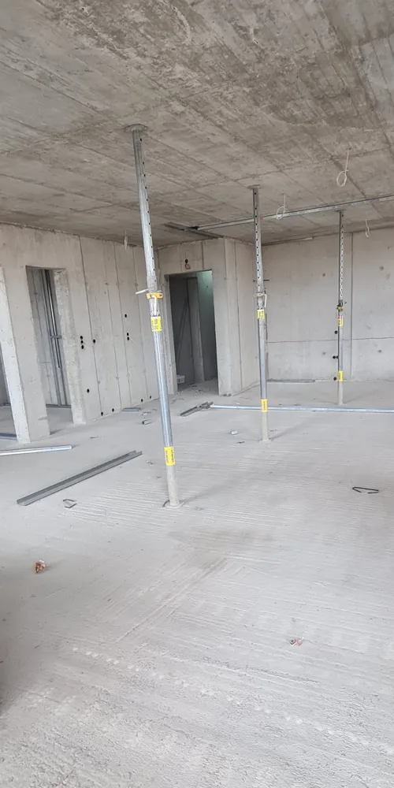
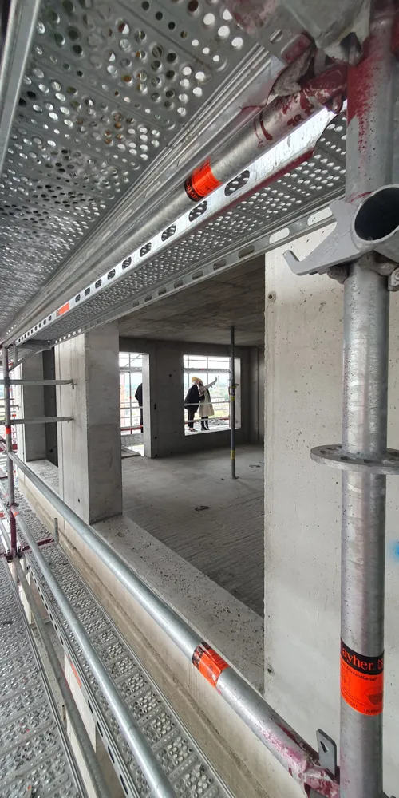
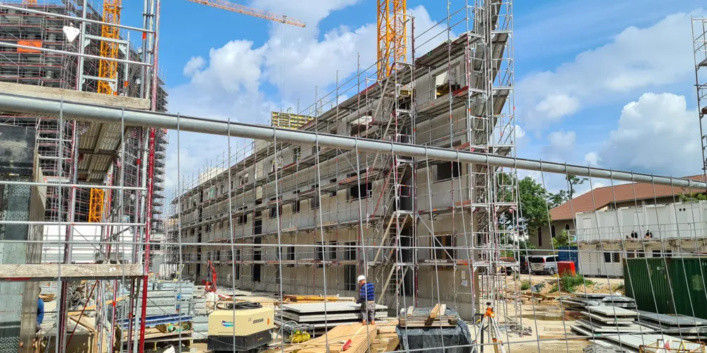
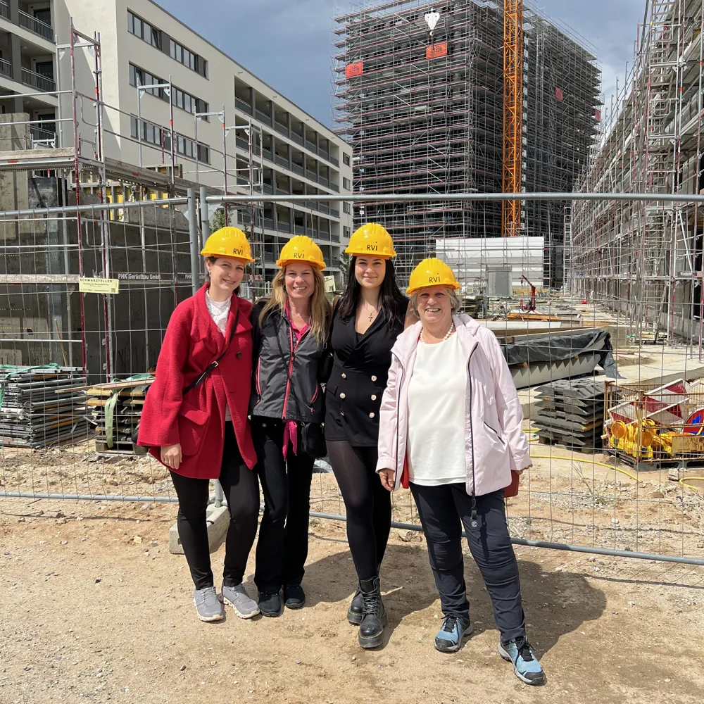

Am 26.07.2023 durften wir exklusiv, erstmals den noch im Bau befindlichen Bauabschnitt
„Orbit“ der New Franklin City in Mannheim – hier insbesondere den „Highrise“ der das „O“ in
diesem neuen Quartier in Mannheim darstellt - erkunden und besichtigen.

Mit dem Schwerlastenzug wurden wir vom EG bis in den 10ten Stock befördert und durften dort in luftiger
Höhe das „O“ erkunden. Man hat einen wunderschönen Ausblick auf ganz Franklin City, einen großartigen
Blick auf den Sportplatz und natürlich auch auf die Europaachse - es war extrem beeindruckend.

Das komplette Objekt ist derzeit mit tausenden Metallgerüstelementen umhüllt, da in Hochtouren am Orbit
gearbeitet wird. Während im 1. OG die Fenster eingebaut werden, wird im 11. OG der Boden bereits betoniert.

Ein weiterer überzeugender Punkt, ist die Tatsache, dass die Baustelle klar erkennbar Sorgfalt,
Qualität, Kompetenz und Sauberkeit ausstrahlt.

In den Innenräumen ist bereits alles sauber verputzt und beschriftet. Auf dem Weg nach unten über das
Treppenhaus war es beeindruckend, jedes Stockwerk in seinem Baufortschritt erleben zu können.

Im EG befinden sich Gewerbeeinheiten mit sehr schönen, hohen Decken und bodentiefen Fenstern.

Innerhalb von einem Jahr sind die Bauarbeiten schon bis in den 10ten Stock fortgeschritten.
Diese Baustelle hat es wirklich in sich!

