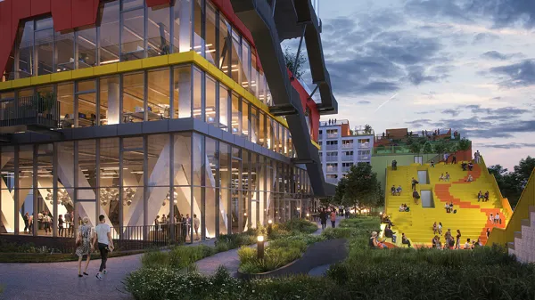

import ContactBox from "/src/components/Newsletter/ContactBox.astro";
import BeraterKarte from "/src/components/Newsletter/BeraterKarte.astro";

Bei i-Live handelt es sich um einen Bauträger für Micro-Apartments, der deutsch&shy;landweit Studenten-,
Senioren-, Business- und Service-<wbr/>Apartments anbietet. i-Live ist zuständig für die Planung,
Objekt&shy;entwicklung, Bau&shy;begleitung, den Verkauf UND die lang&shy;fristige Vermietung und Verwaltung
dieser Wohn&shy;objekte.

----

## [Aktuell] Hannover – Expo Campus
**Micro Apartments (Studentenapartments)**

Der Neubau der i-Live Studenten&shy;apartments in Hannover wird auf dem Gelände der Expo 2000 Hannover errichtet,
direkt neben dem Neubau der Universität Hannover. Ankerpunkt ist der nieder&shy;ländische Pavillon, der damit zu
neuer Blüte erwachen darf. Das Neubau Objekt hat 368 Wohnungen/Apartments, die alle voll&shy;möbliert und
komplett ausgestattet sind.

Für **alle** Apartments des Projektes EXPO Campus Hannover wurden von der Hausbank des Bauträgers im Jahr 2022
KfW-Finanz&shy;ierungs&shy;mittel (KfW 40&nbsp;EE) beantragt und seitens der KfW zugesagt. **Auch bei heutigem Kauf steht
dieses KfW Volumen zur Verfügung**.

- **KfW&nbsp;40EE**
- 150.000 € Darlehen je Wohneinheit
- **2,14 % Zins p.a.**
- Monatlich 602 € inkl. Zinsen + Tilgung
- Kaufpreis pro Apartment 181.000 €
- Kaltmiete pro Monat 468 €

i-Live hatte auch in Corona Zeiten eine durchschnittliche Auslastung von 98 %.

**Eckdaten:**

- Kauf&shy;preis&shy;zahlung nach Makler- und Bauträger&shy;verordnung
- Die Vermietungs&shy;modalität wird über einen Vermietungs&shy;pool gewähr&shy;leistet
- Community Manager betreuen jedes Objekt – dieses gilt sowohl für technische Belange als auch für die
Vermietung und Verpachtung, Paket&shy;service und Planung gemeinsamer Feste
- Es sind weitere Community Flächen wie Learning Lounge, Fitness&shy;lounge, Dach&shy;terrassen und diverse
Freizeit&shy;flächen im Preis inbegriffen

----

**PROJEKTE IN PLANUNGEN:**

- Lübeck Mikroapartments
- Frankfurt Mikroapartments mit Rioca
- Graz Mikroapartments

## Konstanz Seepark: Rioca

Ein weiteres Marken&shy;produkt von i-Live ist Rioca, das Service-Apartments mit brasil&shy;ianischem Flair
anbietet. Rioca bedeutet: Hotel für eine Nacht, bis hin zum Verbleib von bis zu 12 Monaten ohne Miet&shy;vertrag.
Ab geplanter Rohbau&shy;fertig&shy;stellung 12/2023 kann ein Muster&shy;apartment besichtigt werden.

    <BeraterKarte berater="Monika Sanders" />
    <BeraterKarte berater="Milica Bjelovic" />

<ContactBox subject='fintag Newsletter "i-Live Studentenapartments und Service Apartments"' />
