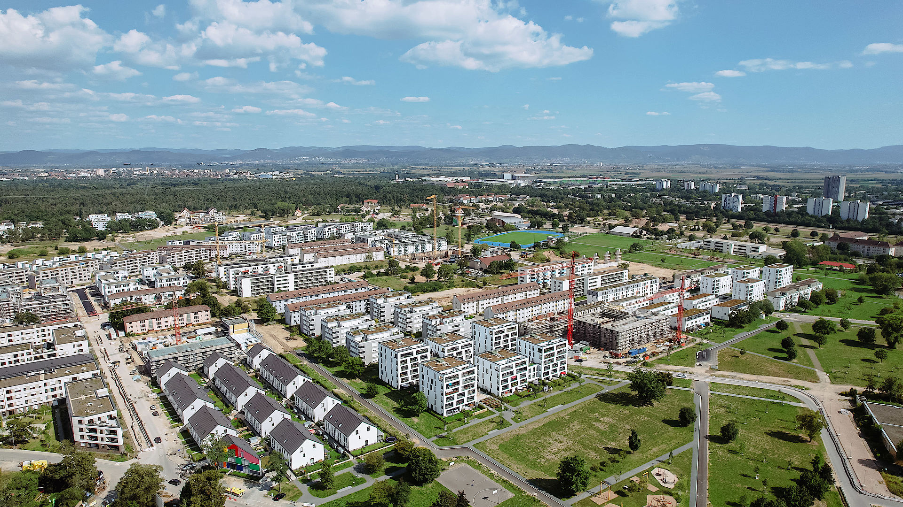

Sehr geehrte Kunden,

Neues Jahr neues Glück, neue großartige Konzepte für Sie!

In den obligatorischen Jahresauftaktveranstaltungen unser Branche wurden hochattraktive Objekte vorgestellt, die noch im 1. Und 2. Quartal 2025 in den Vertrieb gehen.

Wenn Sie für 2025 einen weiteren Vermögensaufbau im Immobilienbereich planen, kommen Sie gerne frühzeitig auf uns zu damit wir Ihnen die besten Einheiten reservieren können.

Auch aus steuerlicher Sicht sind die Projekte bemerkenswert – von Denkmalschutz – über degressive AfA nach dem Wachstumschancengesetz – bis hin zu Objekten mit dem neuen Energiestandard KfW 40 QnG, der eine Anfangsabschreibungsmöglichkeit bis zu 9% der Herstellungskosten ermöglicht - der Korb ist reich gefüllt –

Wir stehen unter den beigefügten Kontaktdaten gerne jederzeit zur Verfügung – wir prüfen gemeinsam mit Ihnen, ob für Sie das Richtige dabei ist!!

Beste Grüße

**Ihre fintag**
