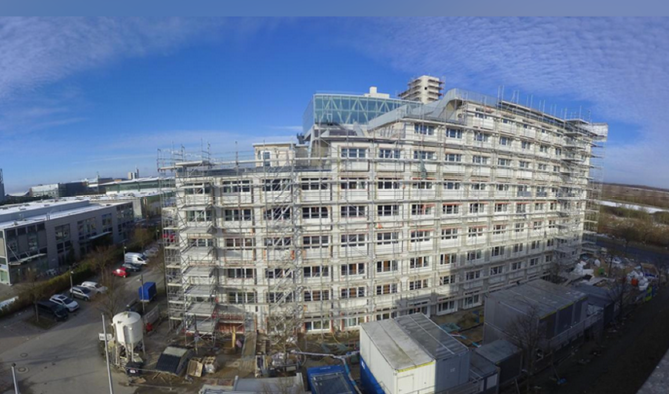
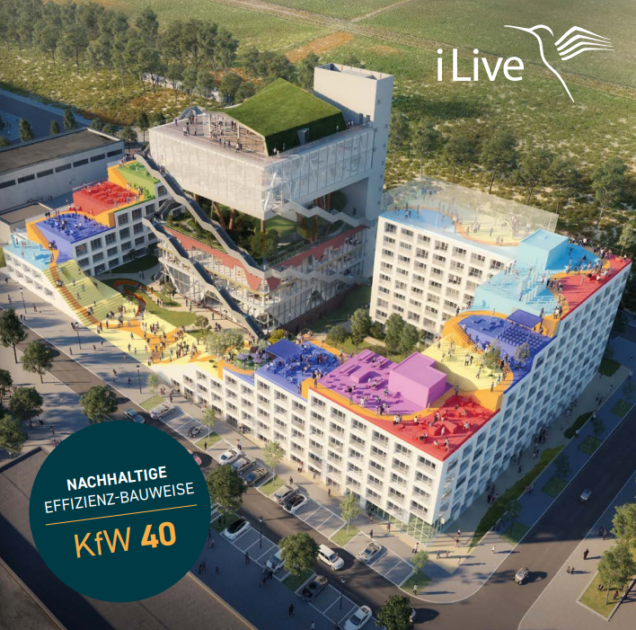

## Unglaublich, aber bei uns jagen sich die guten Nachrichten

Das „O“ ist nun in Fertigstellung, wir freuen uns, Ihnen den beigefügten Artikel aus dem Mannheimer Morgen zuzusenden. In dem Artikel wird nicht nur auf das bisher erbaute Quartier eingegangen, speziell auf das derzeitige Highlight Orbit. Auch in diesem Objekt sind noch einige hochattraktive Einheiten zum Kauf möglich, sowohl Gewerbe als auch Wohnungen.

https://www.mannheimer-morgen.de/orte/mannheim_artikel,-mannheim-exklusive-einblicke-in-mannheims-spektakulaerstes-hochhaus-_arid,2281916.html

----

Ebenso ist die Fertigstellung des Expo Campus, Hannover zum Ende März 2025 vorgesehen. –

Um potenzielle Käufer zu ermuntern, eine der letzten verfügbaren Einheiten in dieses Projekt der Studentenapartments zu
erwerben, hat i-Live eine Sonderaktion gestartet: I Live bietet einen **Rabatt von 5.000,00 €** auf den Kaufpreis der
jeweiligen Einheit. Dieses attraktive Angebot gilt vom **01.02.2025 bis zum 01.04.2025** und wird bei Kaufabschluss
innerhalb dieses Zeitraums gewährt.

Für **alle** Apartments des Projektes EXPO Campus Hannover wurden von der Hausbank des Bauträgers im Jahr 2022
KfW-Finanzierungsmittel (KfW 40 EE) beantragt und seitens der KfW zugesagt. **Auch bei heutigem Kauf steht dieses
KfW Volumen zur Verfügung.**

Die Highlights des KfW Programms sind:
- KfW 40EE
- 150.000 € Darlehen je Wohneinheit
- Ab 1.79% Zins p.a.
- 15.000 € Tilgungszuschuß

Zögern Sie nicht, rufen Sie uns an !

----

Beste Grüße

**Ihre fintag**
