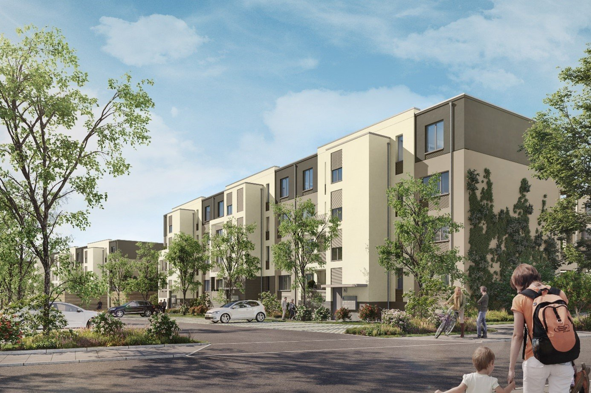

## Terraplan Luz 7

Terraplan, die Erfolgsgeschichte geht weiter! Der erste Bauabschnitt rund um das Speisehaus der Nationen mit 365
Wohnungen ist verkauft, fertig und vermietet. Jetzt startet der Verkauf von Luz 7 in der Luz-Long-Anlage der G.O.L.D.
Gartenstadt Olympisches Dorf von 1936.

Ihre Vorteile:

- **Hohe Steuervorteile** durch Abschreibung nach § 7h EStG (Sanierungsgebiet)
- **KfW-Förderung**: Effizienzhaus 55 EE WPB mit bis zu 150.000 € Darlehen und 45.000 € Tilgungszuschuss (Stand Februar
  2025)
- **Gute Lage**: Nur 25 Minuten mit der Regionalbahn nach Berlin und 30 Minuten mit dem Auto nach Potsdam
- **Bevölkerungs- und Wirtschaftswachstum** sorgen für steigende Mieten und Kaufpreise
- **Gemeinschaftsflächen und grüne Umgebung**: Sportpfad, Kinderspielplätze und Naherholungsgebiete

Die Luz-Long-Anlage ist Teil der **G.O.L.D. Gartenstadt Olympisches Dorf von 1936®** in Berlin, die Sanierung bewahrt
den historischen Charakter und bietet somit ein einmaliges Objekt! terraplan und fintag unterstützen Sie von der
Investition bis zur Vermietung und Verwaltung Ihrer Einheit.

 

**Beispiel:**

|                                      |                    |
|--------------------------------------|-------------------:|
| Kauf einer Wohneinheit mit           |            81,5 qm | 
| Kaufpreis                            |          536.700 € | 
| Fertigstellung                       |               2027 |
|                                      |                    |
| Kapitaleinsatz 2026                  |           51.000 € |
| durchschn. monatliche Rate           | 310 € nach Steuern |
| gesamter Kapitaleinsatz in 27 Jahren |          152.000 € |
|                                      |                    |
| dann getilgte Wohnung im Wert von    |          750.000 € |
| mit freier Mieterwartung von         |           17.000 € |

Möchten Sie mehr erfahren? Wir besprechen gerne Ihre Investitionsmöglichkeiten in einem persönlichen Gespräch. Wir
freuen uns auf Ihre Kontaktaufnahme!

Beste Grüße

**Ihre fintag**
