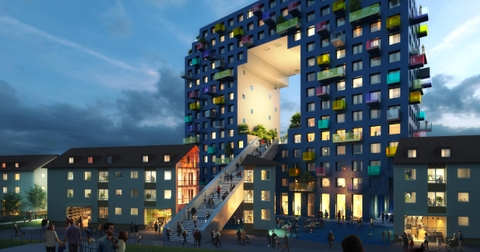
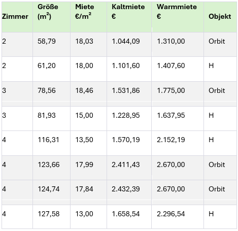
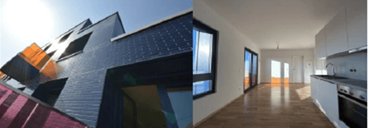

## Ergebnisse aus den ersten tatsächlichen Vermietungen Orbit in Mannheim Franklin City im Vergleich zu den umliegenden Gebäuden

Liebe Kunden,  
Liebe Freunde der Immobilien,

wir freuen uns, Ihnen die aktuellen Mietpreise für Orbit in Mannheim Franklin City präsentieren zu dürfen. Das H, O und das E der 
Buchstabenreihe HOME sind schon fertiggestellt. Das H ist gleichzeitig mit dem O fertiggestellt worden, sodass wir nun einen 
aussagekräftigen Vergleich der Mietpreise vornehmen können.

Im Vergleich zum Gebäude H bietet das Objekt Orbit an jeder Wohnung einen Balkon sowie eine Einbauküche, während diese 
Ausstattungsmerkmale im Gebäude H nicht in jeder Wohneinheit vorhanden sind.

Dieser Überblick verdeutlicht die unterschiedlichen Vermietungsmöglichkeiten, die sich insbesondere durch die hochwertige 
und elegante Ausstattung der jeweiligen Objekte ergeben.

**Mietpreisentwicklung im Vergleich: Orbit & H**

Hier eine Zusammenfassung der aktuellen Mieten für verschiedene Wohnungstypen:

**Interessant ist der Vergleich von Kalt und Warmmiete.**

|                   |         |               |         |
| ----------------- | ------- | ------------- | --------|
| Kaltmiete Orbit   | Ø 18.08 | Kaltmiete H   | Ø14.00  |
| Nebenkosten Orbit | Ø 13.09 | Nebenkosten H | Ø >25 € |

Der Kapitalanleger erhält also aus der Miete eine deutlich höheren Nettomietanteil.

**Aktuelle Vermietungsnachfrage im Orbit**

Es sind im Orbit insgesamt **16 Einheiten vermietet**, wobei die meistgefragten Wohnungen **2-Zimmer** 
mit einer durchschnittlichen Größe von ca. **60 m²** sind.

Von 135 Wohneinheiten stehen noch 16 Einheiten zum Verkauf – von 600.000 – 1.2 Mio., noch gibt es 
die Chance, in diesem sicherlich einmaligen Gebäude eine attraktive Kapitalanlage zu zeichnen.

Möchten Sie mehr erfahren? Wir besprechen gerne Ihre Investitionsmöglichkeiten in einem persönlichen 
Gespräch. Wir freuen uns auf Ihre Kontaktaufnahme!

Beste Grüße

**Ihre fintag**
