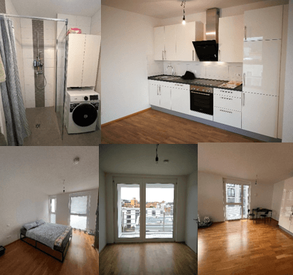

Liebe Kunden,

wir freuen uns, Ihnen heute drei exklusive Wohnungen in bester Lage in Esslingen Citadis 
und Desiro (Bauträger RVI) im neuen Wohnquartier LOK WEST unmittelbar zwischen Bahnhof Esslingen 
und dem Neubau der Hochschule Esslingen anbieten zu dürfen!

Zur Selbstnutzung oder als Kapitalanlage.

**Wohnung C2.29 im Citadis – 2.OG (70,60 m²)**

Diese helle und moderne 2-Zimmer-Eckwohnung im Westen bietet Ihnen fast den ganzen Tag über Sonne. 
Mit ihrer großzügigen Raumaufteilung, einer Einbauküche, Fußbodenheizung und einem schönen Bad ist 
sie perfekt für Singles, Paare oder als Investition geeignet. Der Zugang zur Loggia erfolgt über 
das Schlafzimmer und das Wohnzimmer, sodass Sie auch draußen die Sonne genießen können. Die Wohnung 
ist derzeit noch vermietet. Zu der Wohnung gehören ein Tiefgaragenstellplatz und ein Kellerraum.

**Wohnung C5.08 im Citadis – 5.OG (64,26 m²)**

Diese moderne 2-Zimmer-Wohnung im oberen Stockwerk besticht durch ein großzügiges Wohnzimmer und 
eine angenehme Ost-Ausrichtung. Als Eckwohnung strahlt sie den ganzen Tag Sonne in den Raum – morgens 
bis abends. Auch hier gehören ein Tiefgaragenstellplatz und ein Kellerraum dazu. Die Wohnung ist ab 
dem 31. August 2025 frei.

**Wohnung D1.10 im Desiro – 1.OG (74,80 m²)**

Für Familien oder diejenigen, die mehr Platz suchen, bietet diese 3-Zimmer-Wohnung im Desiro eine 
großzügige Raumaufteilung mit einem schönen Wohn- und Essbereich. Zwei Loggien mit Zugang über das 
Schlafzimmer, das Wohnzimmer und die Küche sorgen für viel Licht und Luft. Die sonnige Südausrichtung 
garantiert Sonne von morgens bis mittags. Die Wohnung ist derzeit noch vermietet. Auch hier gehören 
zur Wohnung ein Tiefgaragenstellplatz und ein Kellerraum.

Hier die Preisübersicht

- **C2.29** – 70,60 m² – Kaufpreis 405.000 € + TG-Stellplatz 26.200 €
- **C5.08** – 64,26 m² – Kaufpreis 385.000 € + TG-Stellplatz 26.200 €
- **D1.10** – 74,80 m² - Kaufpreis 448.000 € + TG-Stellplatz 26.200 €

Hinzu kommt eine Maklerprovision von 3,57 %.

Die Stellplätze können, müssen aber nicht, mitgekauft werden.

Möchten Sie mehr erfahren? Wir besprechen gerne Ihre Investitionsmöglichkeiten in einem persönlichen Gespräch. 

Wir freuen uns auf Ihre Kontaktaufnahme!

Beste Grüße

**Ihre fintag**
