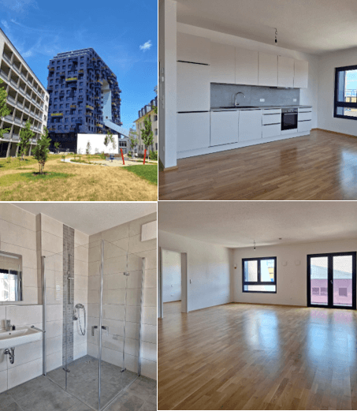
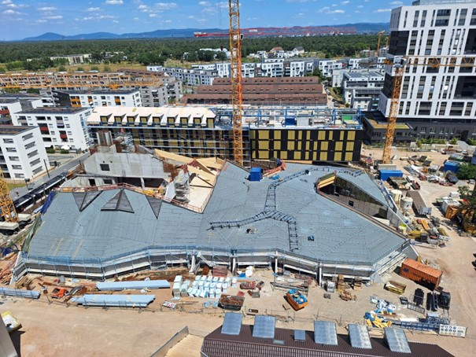
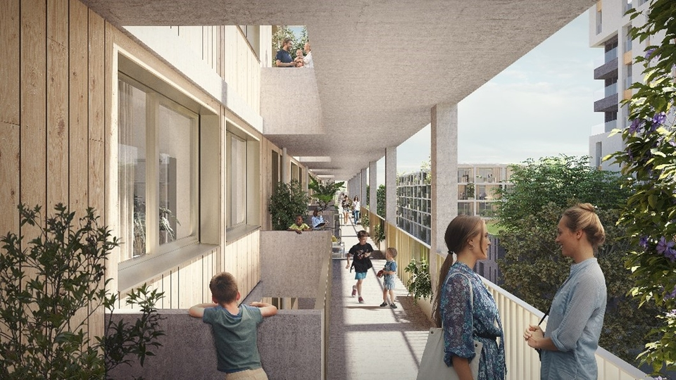
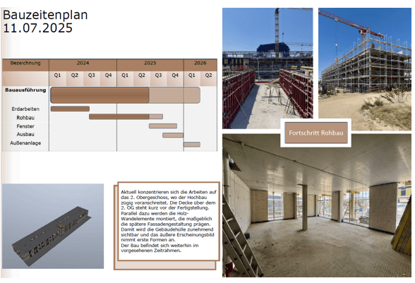

## Neuigkeiten von Orbit- Mietzahlungen, Baufortschritte und ein neues Objekt- Bautenstand Nr. 3 Timber Hill

Liebe Kunden,

wir freuen uns, Ihnen mitteilen zu können, dass die Mietzahlungen von Orbit ab dieser Woche auf den Konten
eingehen. Hier ein paar Einblicke in die Wohnungen vom Orbit

**Der Grüne Hügel – Fortschritt im Bau**

Der Bau schreitet zügig voran. Hier eine Übersicht der geplanten Einzelhändler, die bald in die neue 
Einkaufswelt einziehen werden

- Bäckerei
- Apotheke
- Rossmann
- Intermis-Supermarkt

Es ist noch in Planung, dass eine Bankfiliale, eine Gastro und ein WASGAU Supermarkt mit einziehen soll.

**Was sagt das Handelsblatt?**

aut dem aktuellen Prognos-Zukunftsatlas 2025, veröffentlicht im Handelsblatt, zählt Mannheim erneut zu den 
Regionen mit überdurchschnittlichem Zukunftspotenzial.

**Warum ist Mannheim so attraktiv?**

- Wirtschaftliche Stärke: Eine robuste Industrie- und Dienstleistungsbasis, u.a. Automobil, Chemie und IT
- Bildung & Innovation: Eine Universitätsstadt mit einer lebendigen Forschungslandschaft
- Infrastruktur: Verkehrsknotenpunkt mit ICE-Anbindung im Rhein-Neckar-Dreieck und Nähe zu Frankfurt
- Demografie & Arbeitsmarkt: Überdurchschnittliches Beschäftigungswachstum und Zuzug junger Talente

### Timber Spirit

Ab dem Herbst 2025 kommt von der RVI das Objekt Timber Spirit auf den Markt, das Schwestergebäude zu Timber 
Hill. Gerne melden Sie sich bei uns, um sich eine Einheit vorab zu reservieren, bevor alle weg sind.

**Bautenstand Nr. 3 Timber Hill**

 
Wir halten Sie weiterhin auf den laufenden.

Möchten Sie mehr erfahren? Wir besprechen gerne Ihre Investitionsmöglichkeiten in einem persönlichen Gespräch.  
Wir freuen uns auf Ihre Kontaktaufnahme!

Beste Grüße

**Ihre fintag**

