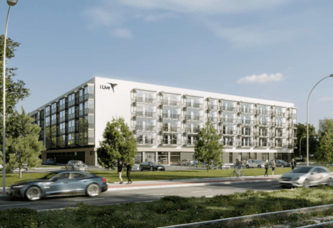
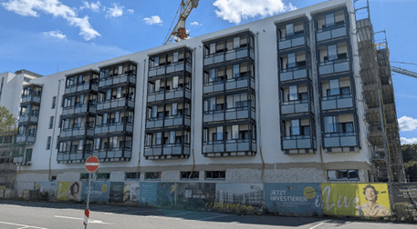

## Entdecken Sie das Neubauprojekt in Rostock- Urban Living Südtor von dem Bauträger i-Live

Liebe Kunden,

Wir freuen uns, Ihnen das neue Objekt - Urban Living Südtor - von dem Bauträger i-Live vorstellen zu dürfen.

Die wunderschöne Universitäts- und Hansestadt Rostock ist bekannt für ihre beeindruckenden Sehenswürdigkeiten, 
ihre lebendige Kultur, zahlreiche Sport- und Freizeitmöglichkeiten sowie die Nähe zur Ostsee und dem beliebten 
Seebad Warnemünde – alles direkt vor der Tür.

In der Nähe des Objektes befindet sich das Klinikum Südstadt Rostock, mehrere Universitäten und Einkaufsmöglichkeiten.

**Eckdaten zum Projekt:**

- **Attraktive Rendite:** Bis zu 5,5 % netto
- Degressive Abschreibung (AfA) 5 %
- Kaufpreise Zwischen 148.978,00 € – € 260.942,00 €
- **18.000,00 € Tilgungszuschuss**
- Wohnfläche pro Apartment zwischen 18 m² und 42 m²
- Eigennutzung möglich
- Insgesamt 180 voll möblierte Apartments mit Terrasse / Balkon
- Der Baubeginn ist Bereits erfolgt! Fertigstellung voraussichtlich im 1. Quartal 2026
- Moderne, energieeffiziente Technik mit niedrigem Energiebedarf im Gebäude
- **Rundum sorglos Paket:** Übernahme von Vermietung und Verwaltung inklusive
- Kein Mietausfall wegen dem Mietpool

Dieses Projekt bietet Ihnen die perfekte Kombination aus Investition und Lebensqualität in einer der schönsten 
Städte Norddeutschlands. Ob als Kapitalanlage oder zum Eigenbedarf.

Es sind derzeit noch ca. 50 Apartments zum Verkauf frei.

Möchten Sie mehr erfahren? Wir besprechen gerne Ihre Investitionsmöglichkeiten in einem persönlichen Gespräch. 
Wir freuen uns auf Ihre Kontaktaufnahme!

Beste Grüße

**Ihre fintag**

