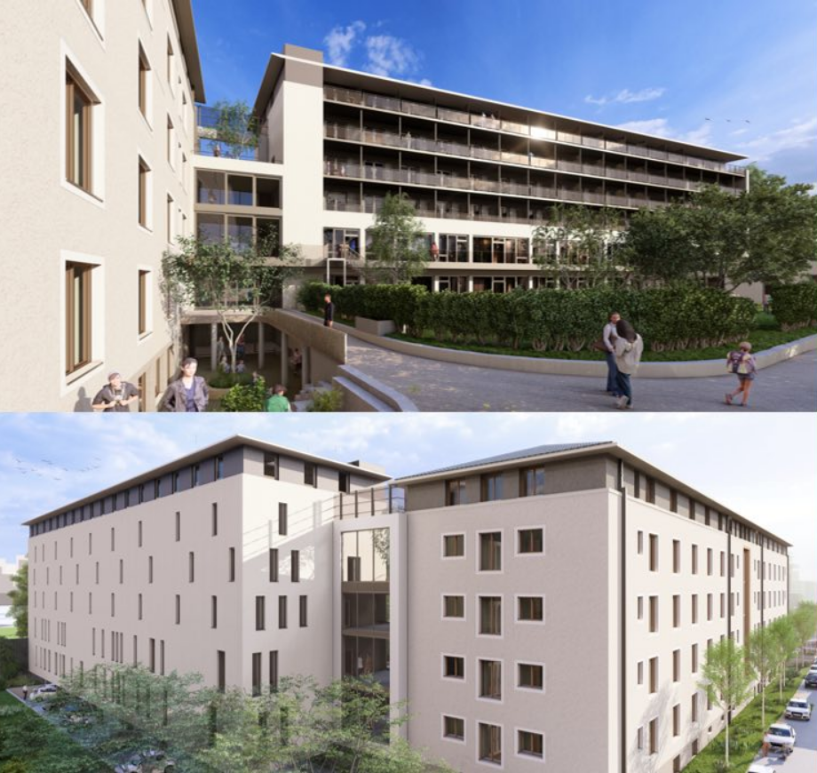

## -in gefragter Uni-Stadtlage

Liebe Kunden,

mit dem neuen Projekt „**Campus Living Saarbrücken**“ realisiert der renommierte Bauträger **i-Live** ein renditestarkes Wohnkonzept toller B-Lage von Saarbrücken – in direkter Nähe zu Universität, Innenstadt und Hauptbahnhof.

In dem ehemaligen Verwaltungsgebäude der Stadt Saarbrücken entsteht durch umfassende Sanierung sowie einen ergänzenden Neubau ein urbanes Wohnensemble mit **203 modernen Wohneinheiten**. Ein zukunftssicheres Investment – optimal auf die Bedürfnisse von **Studierenden, Berufseinsteigern und Pendlern** zugeschnitten.

## Die Eckdaten des Projekts

**Standort:** Hohenzollernstraße 104–106, 66117 Saarbrücken – zentrale, stark nachgefragte Uni-Lage

**Projektumfang:** 

- **147 Micro-Apartments im Bestandsgebäude** (komplett kernsaniert- bisher gewerbliches Gebäude, dadurch Schaffung neuen Wohnraums)
  - Wohnflächen: ca. **19,5 – 49 m²** 
  - Energieeffizienz: **KfW 70 EE**
- **56 Neubau-Apartments**, teils als **2–3-Zimmer-WGs** 
  - Wohnflächen: **ca. 30,5 – 99 m²**
  - Energieeffizienz: **KfW 55**
- Insgesamt: **203 Einheiten**

**Parken:**

- 50 Tiefgaragenstellplätze
- 12 Außenstellplätze

**Kaufpreise: ca. 120.000 € – 562.000 €**  
**Baubeginn: 4. Quartal 2025**

----

### Wohnraum für Studierende & mehr

Die Nachfrage nach modernem, zentral gelegenem Wohnraum für Studierende und junge Berufstätige ist in Saarbrücken ungebrochen hoch. Die Nähe zur Universität, der Fachhochschule sowie zu wichtigen Arbeitgebern macht den Standort **dauerhaft attraktiv**.

Neben klassischen Micro-Apartments stehen auch **größere Einheiten mit WG-Potenzial** zur Verfügung – ideal für Studierende, die gemeinschaftlich wohnen möchten. Dieses flexible Konzept ermöglicht **eine breite Zielgruppenansprache und stabile Mieteinnahmen**.

---- 

### Ihre Vorteile als Kapitalanleger

- **Hohe Mietnachfrage** durch Universitätsstandort mit über 17.000 Studierenden
- **Gesicherte Mieteinnahmen** über den Mietpool
- **Degressive Afa 5% wählbar** sowohl für Neu- als auch für das BEstandsgebäude
- **Diversifizierte Wohnformen:** Micro-Apartments + WG-taugliche Einheiten
- **KfW-förderfähig** (55 / 70 EE) – attraktive Finanzierungsmöglichkeiten
- **KfW Darlehen mit Tilgungszuschuß möglich**
- **Zentrale Lage** mit starker Infrastruktur und ÖPNV-Anbindung
- **Attraktives Preisspektrum** – auch für Einsteiger-Investoren
- **Verwaltung** über die i-Live Group - rundum sorglos

Gerne melden Sie sich bei uns, wenn wir Ihr Interesse hervorgehoben haben.

Beste Grüße

**Ihre fintag**
