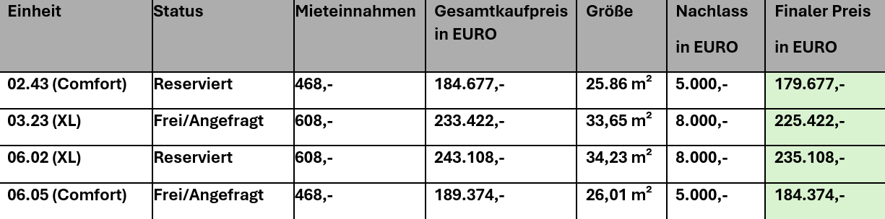
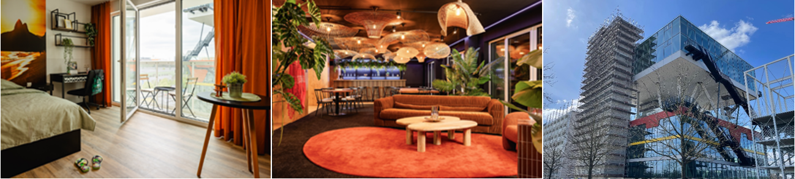

Sehr geehrte Damen und Herren,

4 freigewordene Einheiten im fertigen i-Live Objekt in Hannover warten auf Sie. Nutzen Sie die sofort greifbaren Vorteile und sichern Sie sich top Konditionen:

- Degressive AfA von 5 % – noch bis Jahresende nutzbar
- Letzte Chance: 15.000,- KfW-Tilgungszuschuss direkt mitnehmen
- Zinsgünstiges Darlehen mit sicheren Konditionen (ca. 2,16% eff.) – KfW Darlehn 150.000,- 
- Vermietungsstand November 2025: über 95 %
- Sofortige Mietausschüttung – Cashflow von Anfang an
- Sonderrabatt von 5.000 € auf die Resteinheiten
- Steuervorteil 2025 sofort nutzen

Verfügbare Einheiten – kompakt im Überblick:

Warum jetzt handeln?

- Sie investieren in ein fertiges Objekt mit sofortiger Mieteinnahme.
- Profitieren Sie von exzellenten Finanzierungskonditionen.
- Schnelle Entlastung durch hohe Vermietungsquote und attraktive Preisabschläge.

Interesse geweckt? Kontaktieren Sie uns!
